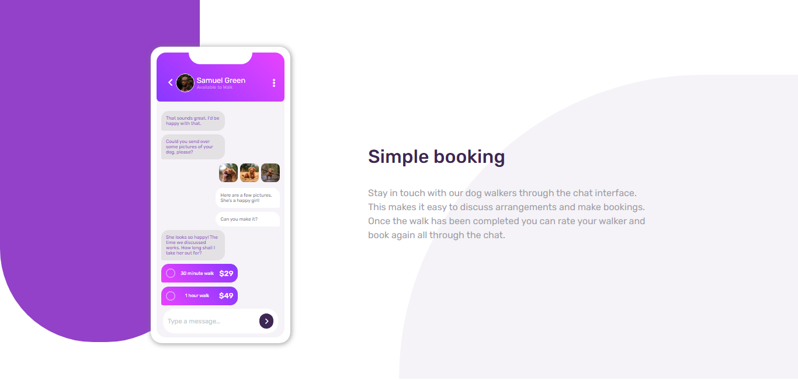
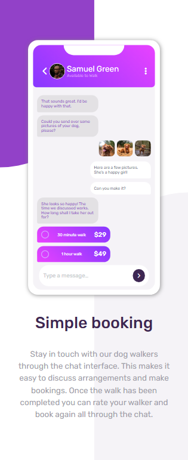

# Frontend Mentor - Chat app CSS illustration solution

This is a solution to the [Chat app CSS illustration challenge on Frontend Mentor](https://www.frontendmentor.io/challenges/chat-app-css-illustration-O5auMkFqY). Frontend Mentor challenges help you improve your coding skills by building realistic projects. 

## Table of contents

- [Overview](#overview)
  - [The challenge](#the-challenge)
  - [Screenshot](#screenshot)
  - [Links](#links)
- [My process](#my-process)
  - [Built with](#built-with)
  - [What I learned](#what-i-learned)
- [Author](#author)

## Overview

### The challenge

Users should be able to:

- View the optimal layout for the component depending on their device's screen size

### Screenshot

### Links

- Solution URL: [Add solution URL here](https://github.com/sudhanshusingh-g/chat-app-illustration)
- Live Site URL: [Add live site URL here](https://sudhanshusingh-g.github.io/chat-app-illustration/)

## My process

### Built with

- Semantic HTML5 markup
- CSS custom properties
- Flexbox
- Mobile first workflow

### What I learned

Responsiveness of the website

## Author

- Website - [Sudhanshu Singh](https://www.linkedin.com/in/sudhanshusingh32/)
- Twitter - [@_sudhanshu97_](https://twitter.com/_sudhanshu97)

